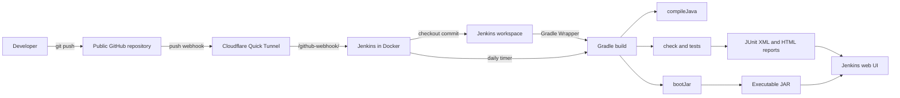
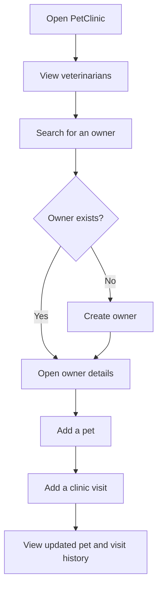

# PetClinic Jenkins and Gradle CI Demo Design

**Status:** Approved for implementation  
**Date:** 2026-09-08  
**Baseline:** `spring-projects/spring-petclinic` at commit `818c413`  
**License:** Preserve the upstream Apache License 2.0 license and attribution.

## Purpose

Build a classroom-ready continuous integration demonstration around the official Spring PetClinic veterinary clinic application. The demonstration must show the full path from a developer pushing a change to GitHub through Jenkins orchestration, Gradle compilation and testing, report publication, and executable JAR creation.

The application remains PetClinic. Its existing owner, pet, veterinarian, and visit features provide the application workflow used during the demo. This iteration adds CI infrastructure and documentation; it does not convert the veterinary domain into a human clinic domain.

## Goals

- Run the PetClinic application locally at `http://localhost:8080` with Java 17 and its default H2 in-memory database.
- Run Jenkins in Docker and expose its web UI at `http://localhost:8081`.
- Store the project in a public, user-owned GitHub repository.
- Trigger Jenkins automatically when a commit is pushed to GitHub.
- Use only the checked-in Gradle Wrapper for compilation, verification, and packaging.
- Show pipeline stages, test results, the Gradle HTML test report, build history, logs, and the executable JAR in the Jenkins web UI.
- Define a daily verification build that demonstrates the lecture's daily-build concept.
- Make setup and presentation repeatable through Docker Compose, Jenkins Configuration as Code, and a demo guide.

## Non-goals

- Rewriting PetClinic as a human clinic management system.
- Adding production deployment, Kubernetes, or a production database.
- Replacing the default server-rendered Spring MVC and Thymeleaf UI.
- Using Maven in the CI pipeline.
- Keeping the temporary public Jenkins tunnel running after the demonstration.

## Architecture



### Component responsibilities

| Component | Responsibility |
|---|---|
| Git | Records versions and supplies the mainline required by the lecture's version-management flow. |
| GitHub | Hosts the public project repository and sends push webhook events. |
| Cloudflare Quick Tunnel | Temporarily exposes the local Jenkins webhook endpoint to GitHub without permanently publishing Jenkins. |
| Jenkins | Receives triggers, checks out the exact commit, orchestrates stages, records history, publishes reports, and archives artifacts. |
| Gradle Wrapper | Selects the project-pinned Gradle distribution and performs compilation, tests, quality checks, incremental task decisions, and JAR packaging. |
| JUnit and existing PetClinic tests | Verify application behavior and produce machine-readable test results. |
| H2 | Supplies a zero-configuration in-memory database for application and test demonstrations. |
| Spring Boot | Runs the application and creates the executable boot JAR. |

## Runtime topology

| Service | Address | Notes |
|---|---|---|
| PetClinic | `http://localhost:8080` | Started with the Gradle Wrapper or the archived boot JAR. |
| Jenkins UI | `http://localhost:8081` | Host port 8081 maps to Jenkins container port 8080. |
| Jenkins agent port | Host port 50000 | Retained for standard Jenkins compatibility; no external agent is required for this demo. |
| Webhook endpoint | `<temporary-tunnel-url>/github-webhook/` | The generated URL is copied into the GitHub webhook configuration before the demo. |

Jenkins and the tunnel run on a dedicated Docker Compose network. Jenkins data uses a named Docker volume so jobs and build history survive container restarts. The application uses the host JDK 17 for the local UI demo, while the Jenkins image contains JDK 17 for CI builds.

## Repository layout

```text
petclinic/
├── Jenkinsfile
├── build.gradle
├── settings.gradle
├── gradlew
├── gradlew.bat
├── src/
├── docker-compose.jenkins.yml
├── infra/
│   └── jenkins/
│       ├── Dockerfile
│       ├── plugins.txt
│       └── jenkins.yaml
├── .env.example
├── docs/
│   ├── DEMO_GUIDE.md
│   └── superpowers/
│       └── specs/
└── LICENSE.txt
```

The existing application source, Gradle configuration, and tests remain the source of application behavior. CI-specific files stay at the repository root or under `infra/jenkins` so application and infrastructure responsibilities remain clear.

## Jenkins provisioning

A custom Jenkins image based on the Jenkins LTS JDK 17 image installs a pinned set of plugins at image-build time:

- Pipeline aggregator
- Git and GitHub integration
- GitHub Branch Source
- JUnit result publishing
- HTML Publisher
- Pipeline Graph View
- Configuration as Code
- Job DSL

Jenkins Configuration as Code creates the local administrator and a Pipeline job. The administrator username, administrator password, and public GitHub repository URL come from a local `.env` file. `.env.example` documents the required variable names; the real `.env` is ignored by Git.

The public repository requires no Jenkins checkout token. GitHub webhook creation is performed in the repository settings after the temporary tunnel URL is known. No GitHub token, Jenkins password, or webhook credential is committed to source control.

## Pipeline design

The repository-root `Jenkinsfile` is the single source of truth for CI behavior. It declares both a GitHub push trigger and a daily timer trigger.

### Stages

1. **Checkout** — Jenkins checks out the exact Git commit associated with the build.
2. **Verify Tools** — `java -version` and `./gradlew --version` prove that Java 17 and the project Gradle Wrapper are being used.
3. **Scheduled Clean** — executes `./gradlew clean --no-daemon` only when the build was started by the daily timer. This gives the daily build a clean baseline without defeating incremental behavior on push builds.
4. **Compile** — executes `./gradlew compileJava --no-daemon`.
5. **Test and Verify** — executes `./gradlew check --no-daemon`, including the existing JUnit tests and configured code-quality checks.
6. **Package** — executes `./gradlew bootJar --no-daemon` only after verification succeeds.

### Post-build reporting

- Always publish `build/test-results/test/*.xml` with the Jenkins JUnit publisher when results exist.
- Always publish `build/reports/tests/test/index.html` as **Gradle Test Report** when the report exists.
- Archive `build/libs/*.jar` with fingerprints only on successful builds.
- Preserve the full console output per stage for diagnosis.
- Mark compilation or Gradle command failures as failed builds. Test-result failures are visible at both the relevant stage and test-detail page.

### Gradle incremental-build demonstration

Webhook builds do not call `clean`. Jenkins keeps its workspace, so a second build of an unchanged commit can show Gradle tasks as `UP-TO-DATE`. The daily build performs `clean` first and demonstrates a complete rebuild. Together these flows cover both minimal recompilation and scheduled complete-system building from the lecture.

## Application user flow



This flow demonstrates that the built artifact is a functioning system rather than only a successful compilation result.

## Complete demonstration sequence

1. Start Jenkins and the Cloudflare tunnel with Docker Compose.
2. Open the Jenkins dashboard on port 8081 and confirm that the Pipeline job exists.
3. Read the temporary tunnel URL from the tunnel container logs and configure the GitHub push webhook ending in `/github-webhook/`.
4. Start PetClinic locally and demonstrate viewing veterinarians, finding or creating an owner, adding a pet, and adding a visit.
5. Make a harmless, visible source change, commit it, and push it to the public GitHub repository.
6. Show the successful GitHub webhook delivery.
7. Show Jenkins automatically starting a build and progressing through the stage graph.
8. Open the Jenkins test-result page and the published Gradle HTML report.
9. Download or identify the fingerprinted executable JAR from the build's Artifacts section.
10. Rebuild the unchanged commit and point out Gradle `UP-TO-DATE` tasks.
11. Show the daily timer in `Jenkinsfile` and explain that its clean build implements the lecture's daily-build process.
12. Stop the Cloudflare tunnel after the demonstration.

## Failure handling and recovery

- A nonzero exit from compilation, verification, or packaging stops later dependent stages and marks the build failed.
- Test and HTML reports use missing-report-safe publication so an early compile failure does not hide the original error with a secondary publishing error.
- The console log remains available for the failed stage.
- If GitHub cannot reach the temporary tunnel, GitHub's webhook-delivery page supplies the response status and redelivery control.
- If the tunnel URL changes, replace the webhook payload URL before retrying.
- Jenkins **Build Now** remains a backup trigger for diagnosing Jenkins or Gradle independently of the webhook path.
- If the H2 application is restarted, its seeded demo data is recreated; persistent data is intentionally outside this demo's scope.

## Security and cleanup

- Keep `.env` outside version control and use a nontrivial temporary Jenkins administrator password.
- Keep the GitHub repository free of application and infrastructure secrets.
- Expose Jenkins through the tunnel only for the duration of webhook testing and the classroom demo.
- Do not expose the Docker daemon to the Jenkins container.
- Stop the tunnel after the demo; stop Jenkins when it is no longer needed.
- Preserve upstream license and attribution files.

## Verification strategy

1. Run `./gradlew check bootJar --no-daemon` locally and confirm all existing PetClinic checks pass and a boot JAR is produced.
2. Run `docker compose -f docker-compose.jenkins.yml config` to validate the Compose model without starting services.
3. Build the custom Jenkins image and confirm required plugins install successfully.
4. Start the Compose services and verify the Jenkins login and Pipeline job through the web UI.
5. Run the Jenkins job manually once to isolate build configuration from webhook configuration.
6. Configure the GitHub webhook, push a commit, and verify the webhook-triggered run records the pushed commit.
7. Verify Jenkins exposes JUnit results, the Gradle HTML report, and the fingerprinted JAR.
8. Start the archived JAR on port 8080 and execute the owner, pet, veterinarian, and visit user flow.
9. Run an unchanged push build and verify Gradle reports eligible tasks as `UP-TO-DATE`.

## Lecture alignment

| Lecture concept, pages 4–11 | Project implementation |
|---|---|
| Automated system building | Gradle consumes source, resources, configuration, dependencies, and tests to create the Spring Boot JAR. |
| Version-control integration | Jenkins checks out the pushed commit from the public GitHub mainline. |
| Minimal recompilation | Gradle input/output tracking skips unchanged tasks in persistent Jenkins workspaces. |
| Executable-system creation | Spring Boot's `bootJar` task creates `build/libs/*.jar`. |
| Test automation | Gradle `check` runs the configured test and quality tasks. |
| Reporting | Jenkins publishes stage status, logs, JUnit details, the Gradle HTML report, and artifact fingerprints. |
| Continuous integration | A GitHub push webhook automatically starts the Jenkins Pipeline. |
| Daily build | The Jenkins timer starts a clean verification and package build each day. |
| Compilation and linking | Gradle compiles Java classes, resolves libraries, and packages the application while tracking task inputs by content and metadata. |

## Acceptance criteria

- PetClinic runs at `http://localhost:8080` with the default H2 profile.
- Jenkins runs in Docker and its web UI is reachable at `http://localhost:8081`.
- A push to the public GitHub repository automatically creates a Jenkins build through the webhook tunnel.
- The Jenkins stage graph displays checkout, tool verification, compilation, testing, and packaging.
- A successful build displays JUnit results and a browsable Gradle HTML test report.
- A successful build exposes a fingerprinted executable JAR artifact.
- A repeated unchanged build demonstrates at least one relevant Gradle task as `UP-TO-DATE`.
- The Jenkinsfile contains the daily timer and the scheduled clean-build behavior.
- `docs/DEMO_GUIDE.md` provides complete setup, webhook, presentation, troubleshooting, and shutdown instructions.
- No secret value is tracked by Git.

